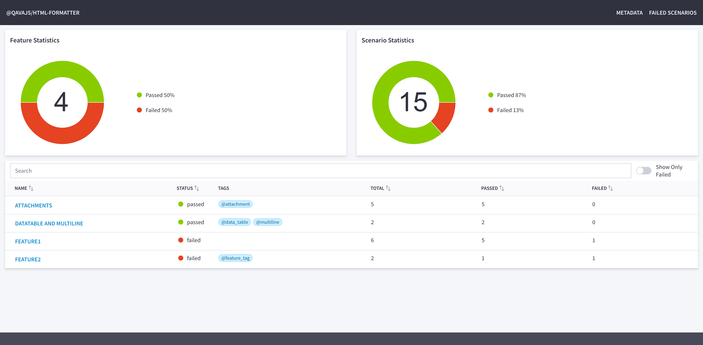

# @qavajs/html-formatter

Single file HTML formatter for cucumber framework

### Installation
To install formatter run

`npm install @qavajs/html-formatter`

and add to formatter section in config file

```javascript
module.exports = {
    default: {
        format: ['@qavajs/html-formatter:report.html']
    },
    formatOptions: {
        htmlConfig: {
            metadata: {
                'OS': 'macos',
                'OS Version': '13.1'
            }
        }
    },
}
```

or pass `--format @qavajs/html-formatter:report.html` in cli



Kudos to https://github.com/epam/UUI for providing components

